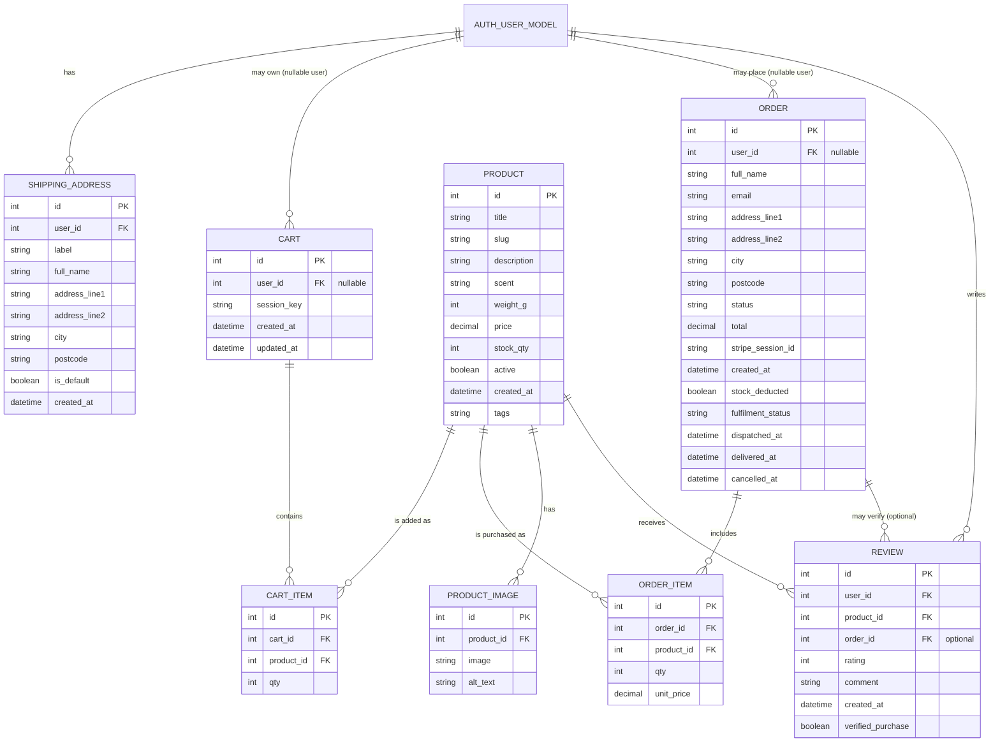

# Data Models

This document explains the core Django models used across the project, how they relate to each other, and why certain modelling decisions were made (e.g., `on_delete` choices, uniqueness constraints, and integrity rules).

---

## High-level structure

The data model supports a typical e-commerce flow:

**Product catalogue → Cart (guest or user) → Order → Review (optionally verified via Order)**

In addition, authenticated users can store **saved shipping addresses**, including enforcement of a single default address per user.

---

## ERD (Entity–Relationship Diagram)

---

## `accounts` app

### `ShippingAddress`
Stores **saved delivery addresses** for authenticated users.

**Key design points**
- **One-to-many relationship:** one user can have many shipping addresses via `related_name="shipping_addresses"`.
- **Default address integrity:** the overridden `save()` method enforces a *single* default address per user by unsetting `is_default` on all other addresses whenever a new default is saved.
- **Timestamps:** `created_at` is stored for audit/history.

#### ShippingAddress.user
- **Type:** ForeignKey → `AUTH_USER_MODEL`
- **on_delete:** `CASCADE`
- **Why:** if a user is removed, their saved addresses should not remain orphaned.

#### ShippingAddress.is_default (integrity rule)
- Ensures at most one default address per user.
- Enforced at the model layer (not only in the UI), which improves data consistency.

---

## `catalog` app

### `Product`
Represents the core sellable item in the store.

**Key design points**
- **Slug auto-generation:** the `save()` method generates a unique slug if one is not provided, supporting clean and stable URLs.
- **Stock & visibility:** `stock_qty` and `active` allow items to be tracked and hidden without deletion.
- **Tags:** a simple comma-separated `tags` field supports lightweight grouping/filtering without introducing another model.

#### Product.slug (uniqueness)
- Ensures clean URLs and avoids collisions by incrementing `-1`, `-2`, etc.

### `ProductImage`
Stores one or more images per product.

**Key design points**
- **One-to-many relationship:** a product can have many images via `related_name="images"`.
- **Accessibility:** `alt_text` supports better accessibility and SEO.

---

## `cart` app

### `Cart`
Represents a shopping cart for either:
- **Authenticated users** (`user` foreign key), or
- **Guest users** via a `session_key`

**Key design points**
- The `user` field is nullable, allowing carts to exist for guests.
- `total` is computed from related line items, preventing duplicate/stale totals.

#### Cart.user (nullable)
- **Type:** ForeignKey → `AUTH_USER_MODEL`
- **null/blank:** True
- **Why:** supports guest carts without forcing authentication.

### `CartItem`
Represents a single line item in the cart.

**Key design points**
- **Uniqueness rule:** `unique_together = ("cart", "product")` prevents duplicate lines for the same product in one cart.
- **Subtotal:** computed dynamically as `qty * product.price`.
- **Protection on products:** `on_delete=PROTECT` prevents deleting products that are referenced by cart items (implementation choice that avoids broken references).

---

## `checkout` app

### `Order`
Represents a completed purchase, supporting both **guest** and **authenticated** checkout.

**Key design points**
- **User is optional:** orders can be created for guests (`user` nullable with `SET_NULL`).
- **Separation of concerns:** payment state (`status`) and delivery lifecycle (`fulfilment_status`) are tracked independently.
- **Stripe integration:** `stripe_session_id` links the order to the Stripe checkout session.
- **Stock safety:** `stock_deducted` helps prevent stock being deducted more than once in asynchronous flows.

#### Order.user (nullable)
- **Type:** ForeignKey → `AUTH_USER_MODEL`
- **on_delete:** `SET_NULL`
- **Why:** preserves order history even if a user account is deleted.

### `OrderItem`
Represents an item purchased as part of an order.

**Key design points**
- **Price snapshot:** `unit_price` stores the price at purchase time, ensuring accurate order history even if product prices change later.
- **Product protection:** `on_delete=PROTECT` prevents deleting products that appear in historical orders.

---

## `reviews` app

### `Review`
Stores a review for a product written by a user.

**Key design points**
- **One review per user per product:** enforced with `unique_together = ("user", "product")`.
- **Optional order link:** `order` can link a review to an order to support “verified purchase” logic.
- **Ordering:** reviews are ordered newest-first via `ordering = ["-created_at"]`.

#### Review.order (optional link)
- **Type:** ForeignKey → `Order`
- **null/blank:** True
- **on_delete:** `SET_NULL`
- **Why:** keeps reviews even if order records are adjusted, while still allowing a verification link.

---

## Relationship index (quick links)

- **ShippingAddress → User:** `ShippingAddress.user`
- **Cart → User (optional):** `Cart.user`
- **CartItem → Cart:** `CartItem.cart`
- **CartItem → Product:** `CartItem.product`
- **Order → User (optional):** `Order.user`
- **OrderItem → Order:** `OrderItem.order`
- **OrderItem → Product:** `OrderItem.product`
- **ProductImage → Product:** `ProductImage.product`
- **Review → User:** `Review.user`
- **Review → Product:** `Review.product`
- **Review → Order (optional):** `Review.order`